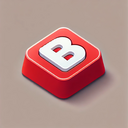

# Boss Key

 <!-- Replace with your actual logo path -->

## Description

**Boss Key** is a simple browser extension that allows you to quickly "exit the page" and navigate away from the current website using a keyboard shortcut or a toolbar button. 
It's perfect for those moments when you need to quickly switch to a different site without drawing attention. 

It’s intended to be a safety tool, inspired by the [gov.uk feature](https://beeps.website/blog/2024-10-09-why-govuk-exit-this-page-doesnt-use-escape/).

## Features

- **Quick Navigation**: Use a keyboard shortcut or click the toolbar button to navigate away from the current page.

## Installation

### For Chrome

1. Download or clone this repository.
2. Open your Chrome browser and navigate to `chrome://extensions/`.
3. Enable "Developer mode" in the top right corner.
4. Click on "Load unpacked" and select the directory where you downloaded or cloned the repository.
5. The Boss Key extension should now be installed and ready to use!

### For Firefox

1. Download or clone this repository.
2. Open your Firefox browser and navigate to `about:debugging#/runtime/this-firefox`.
3. Click on "Load Temporary Add-on."
4. Select the `manifest.json` file from the directory where you downloaded or cloned the repository.
5. The Boss Key extension should now be installed and ready to use!

## Usage

- **Keyboard Shortcut**: Press `Shift + Alt + E` to navigate away from the current page.
- **Toolbar Button**: Click the Boss Key icon in the toolbar to trigger the navigation.

## Contributing

Contributions are welcome! If you have suggestions for improvements or new features, feel free to open an issue or submit a pull request.

## License

This project is licensed under the MIT License. See the [LICENSE](LICENSE) file for details.

## Acknowledgments

- Thanks to the Chrome Extensions documentation for guidance on building this extension.
- Special thanks to the open-source community for their contributions and support.

## Contact

For any questions or feedback, please reach out.

